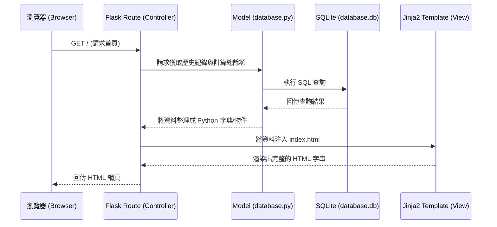
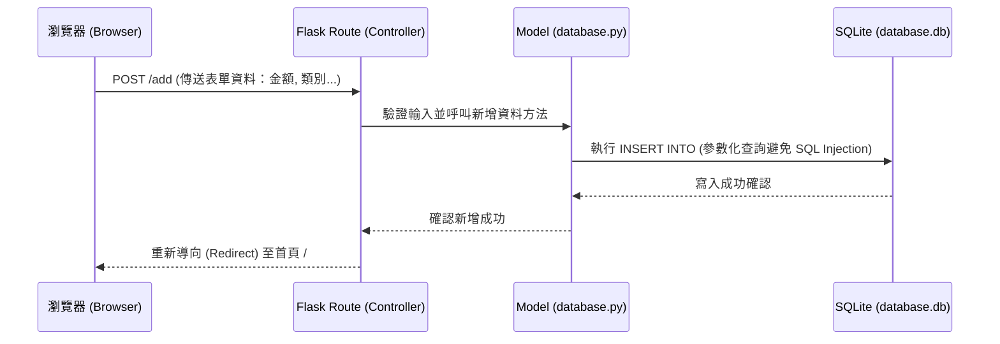

# 系統架構設計 (Architecture)

這份文件基於 [個人記帳系統 PRD](PRD.md) 的需求，規劃本專案的技術架構、資料夾結構與系統內各元件的負責範圍。

## 1. 技術架構說明

本專案採用傳統的伺服器端渲染 (Server-Side Rendering) 架構，不進行前後端分離，確保專案能輕量且快速地開發。

### 選用技術與原因
- **後端框架：Python + Flask**
  - **原因**：Flask 輕量、彈性大，且語法直覺，非常適合用來快速開發如「個人記帳系統」這類的小型 Web 應用程式。
- **模板引擎：Jinja2**
  - **原因**：內建於 Flask 中，可以直接將後端的 Python 資料注入到 HTML 中渲染，無需額外建立前端 API 即可完成頁面呈現。
- **資料庫：SQLite**
  - **原因**：無需額外架設資料庫伺服器，資料儲存在單一檔案中，適合單人使用的記帳系統，備份也十分方便。

### Flask MVC 模式說明
在本專案中，我們將採用簡易的 MVC (Model-View-Controller) 架構模式：
- **Model (資料模型)**：負責定義資料結構與操作 SQLite 資料庫（例如新增一筆收支紀錄、計算總餘額等）。
- **View (視圖)**：負責呈現使用者介面，也就是我們寫在使用 Jinja2 語法的 HTML 模板，用來展示帳目清單與總結餘。
- **Controller (控制器)**：由 Flask 的路由 (Routes) 扮演此角色。負責接收使用者的 HTTP 請求、從 Model 獲取或寫入資料，最後將資料交給 View 來產生對應的畫面。

---

## 2. 專案資料夾結構

以下為建議的專案資料夾樹狀結構：

```text
web_app_development/
├── app/                      # 應用程式主要程式碼
│   ├── static/               # 靜態資源 (前端所需檔案)
│   │   ├── css/              # 樣式表 (style.css)
│   │   └── js/               # 前端腳本
│   ├── templates/            # Jinja2 HTML 模板檔案 (視圖 View)
│   │   ├── base.html         # 共用的版型骨架
│   │   └── index.html        # 首頁 (顯示收支清單與餘額)
│   ├── models/               # 資料庫模型與操作邏輯 (模型 Model)
│   │   └── database.py       # 定義如何與 SQLite 互動
│   └── routes/               # Flask 路由處理 (控制器 Controller)
│       └── main_routes.py    # 定義首頁載入、新增、刪除等端點
├── docs/                     # 專案說明文件
│   ├── PRD.md                # 產品需求文件
│   └── ARCHITECTURE.md       # 系統架構文件 (本文件)
├── instance/                 # Flask 專屬資料夾，放置不進版控的敏感/變動檔案
│   └── database.db           # SQLite 資料庫實體檔案
├── app.py                    # 應用程式入口 (負責啟動 Server)
└── requirements.txt          # 記錄專案所需的 Python 依賴套件
```

---

## 3. 元件關係圖

以下展示系統在處理不同請求時各元件之間的互動流程。

### 請求流程：載入首頁與帳目清單


### 請求流程：新增一筆紀錄


---

## 4. 關鍵設計決策

1. **資料夾與 MVC 職責分離**：
   因應記帳系統未來可能擴充分析圖表等功能，並非將所有邏輯塞塞在 `app.py` 中，而是決定拆分出 `models` 與 `routes`，以確保日後好維護。

2. **不使用 SQLAlchemy (ORM) 而是原生 sqlite3**：
   為了明確達到 PRD 規範與學習目的中的「參數化查詢 (Parameterized Query)」，並且專案資料表結構單純，我們使用原生的 `sqlite3` 來撰寫 SQL，這樣開發者能更透明直觀地了解背後執行的資料庫查詢。

3. **不設計複雜的前端框架 (如 React / Vue)**：
   根據 PRD 要求不需前後端分離，我們將依賴 Flask 與 Jinja2 在 Server 端完成最後的 HTML 建立；這能加快系統的首頁加載速度 (< 1秒) 且減少串接 API 的成本。

4. **UI 設計方針 (Rich Aesthetics)**：
   針對前端介面不使用基本的按鈕樣式，而是要引入現代化網頁設計，如動態效果、客製化的排版與高品質色彩配置，以帶來極佳的使用者體驗 (WOW feeling)。
