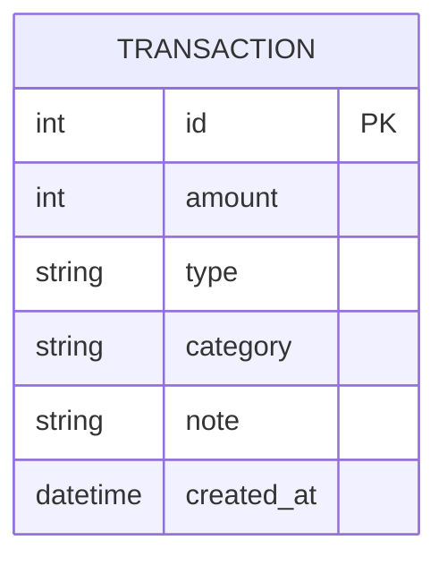

# Database Design (資料庫設計)

本文件依據 PRD 與架構設計，規劃系統的資料庫結構。因系統單純，採用單一 `transactions` 資料表來記錄所有的收支明細。

## 1. ER 圖

## 2. 資料表詳細說明

### `transactions` (交易紀錄表)
用來儲存所有使用者的收支明細。

| 欄位名稱 | 資料型別 | 屬性 | 說明 |
| -------- | -------- | ---- | ---- |
| `id` | INTEGER | PK, AUTOINCREMENT | 唯一識別碼 |
| `amount` | INTEGER | NOT NULL | 交易金額 (正整數) |
| `type` | TEXT | NOT NULL | 屬性：`'income'`(收入) 或 `'expense'`(支出) |
| `category` | TEXT | NOT NULL | 類別：如 '飲食', '交通', '薪水', '娛樂' 等 |
| `note` | TEXT | | 備註說明，補充這筆帳目的資訊 |
| `created_at` | DATETIME | DEFAULT CURRENT_TIMESTAMP | 建立時間，自動帶入當前時間 |

## 3. SQL 建表語法

建表語法請見獨立檔案：`database/schema.sql`。這個檔案可以在系統初始化時，用來建立 SQLite 資料庫及所需的表結構。

## 4. Python Model 程式碼

根據架構設計與 `db-design` 技能的指引，我們實作了以下兩個模組：
1. `app/models/database.py`：負責連接及初始化 `database.db`。
2. `app/models/transaction.py`：定義 `Transaction` 類別，封裝對 `transactions` 表的 CRUD 操作及 `get_total_balance` 方法來計算累計餘額。

所有的查詢都已實作參數化 (Parameterized Query)，以防止 SQL Injection。
