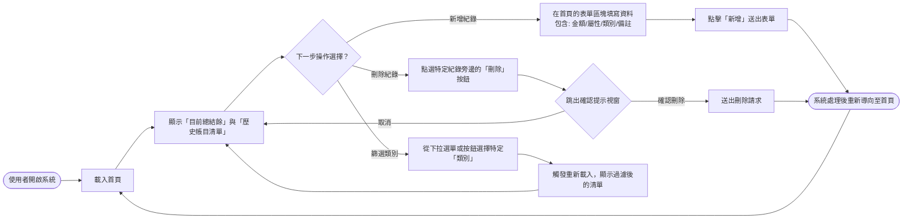
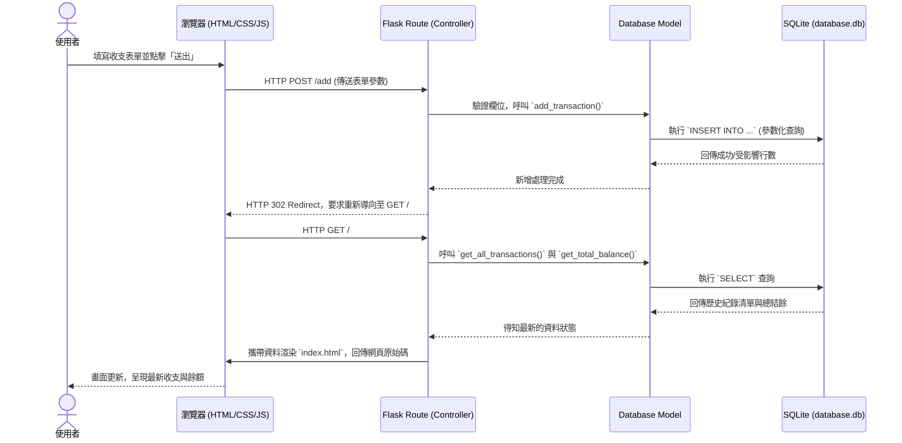

# 使用者與系統流程圖 (Flowcharts)

這份文件基於 PRD 與系統架構設計，利用各種流程圖與表格進一步視覺化使用者的操作路徑（User Flow），以及系統內部的資料流（System Sequence Diagram）。此文件有助於我們確認所有必備功能（新增、刪除、查看、篩選）的操作動線皆合理明確。

## 1. 使用者流程圖（User Flow）

當使用者開啟我們這套「個人記帳系統」時，將會經歷以下的互動路徑。我們力求在「單一頁面（首頁）」內完成大部分核心操作，以符合「輕量快速」的核心價值。

## 2. 系統序列圖（Sequence Diagram）

以下是一張描述**「使用者送出新增收支紀錄」**直到**「頁面重新載入顯示最新畫面」**的完整內部資料流動序列圖。

## 3. 功能清單與路由對照表

根據上述流程，我們可以大致規劃出以下與前端介面互動的 Flask 後端路由：

| 功能名稱 | 對應路徑 (URL) | HTTP 方法 | 主要負責工作說明 |
| :--- | :--- | :--- | :--- |
| **載入首頁與全紀錄** | `/` | `GET` | 系統預設進入點。依據資料庫查詢所有的歷史收支紀錄、計算出總餘額，並將這些資訊傳遞給 Jinja2 模型來渲染 `index.html` 頁面。 |
| **類別篩選顯示** | `/?category=xxx` 或 `/filter` | `GET` | 處理含有條件引數的查詢。從 SQLite 只讀取某一個特定類別（例如：飲食）的項目，並渲染回首頁列表。 |
| **新增收支紀錄** | `/add` | `POST` | 專門接收使用者送出的表單 `FormData`，包含金額、類別、備註等資訊。寫入 SQLite 資料庫後，重新導向 (Redirect) 回首頁。 |
| **刪除特定紀錄** | `/delete/<int:record_id>` | `POST` | 為遵守安全性實踐，盡量不透過 `GET` 執列具破壞性的操作。會接收指定紀錄的 ID，從 SQLite 執行 `DELETE` 後，重新導向回首頁。 |
